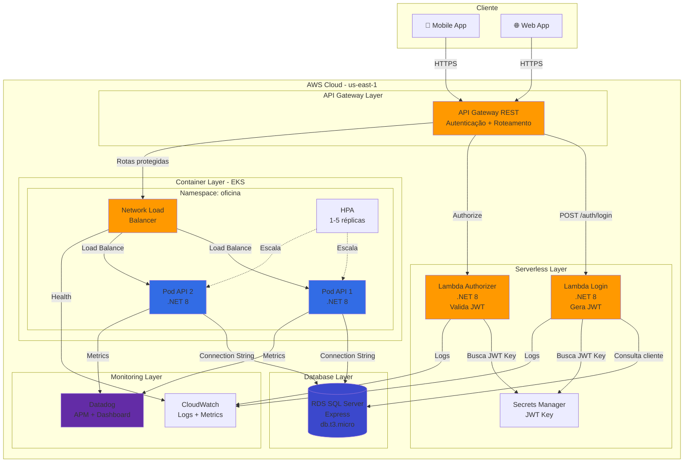

# 🏗️ Arquitetura - AutoRepairShop

## Diagrama de Componentes



---

## Visão Geral da Arquitetura

### **Camadas**

1. **API Gateway Layer**
   - Ponto único de entrada
   - Gerenciamento de rotas
   - Rate limiting
   - Autenticação/Autorização

2. **Serverless Layer**
   - Lambdas para autenticação
   - Stateless
   - Auto-scaling
   - Custo otimizado

3. **Container Layer (EKS)**
   - Aplicação principal em Kubernetes
   - Alta disponibilidade (Multi-AZ)
   - Auto-scaling horizontal (HPA)
   - Load balancing (NLB)

4. **Database Layer**
   - RDS SQL Server gerenciado
   - Backups automáticos (7 dias)
   - Multi-AZ disponível
   - Subnets privadas

5. **Monitoring Layer**
   - CloudWatch (AWS nativo)
   - Datadog (APM + Dashboard)
   - Logs centralizados
   - Alertas proativos

---

## Fluxo de Dados

### **1. Autenticação**
```
Cliente → API Gateway → Lambda Login → RDS → JWT Token → Cliente
```

### **2. Requisição Protegida**
```
Cliente → API Gateway → Lambda Authorizer → (Valida JWT) → Backend API (EKS) → RDS → Resposta
```

### **3. Monitoramento**
```
Todos os componentes → CloudWatch/Datadog → Dashboard → Alertas
```

---

## Tecnologias por Componente

| Componente | Tecnologia | Justificativa |
|------------|-----------|---------------|
| API Gateway | AWS API Gateway REST | Gerenciamento centralizado, baixo custo |
| Lambda | .NET 8 | Mesma stack da API, performance |
| Container Runtime | EKS 1.31 | Kubernetes gerenciado, HA |
| Banco de Dados | RDS SQL Server Express | Gerenciado, backups automáticos |
| Secrets | AWS Secrets Manager | Rotação automática, criptografia |
| Load Balancer | Network Load Balancer | Baixa latência, Layer 4 |
| Monitoring | Datadog + CloudWatch | APM completo + nativo AWS |
| CI/CD | GitHub Actions | Integração nativa com repos |
| IaC | Terraform | Multi-cloud, reusável |

---

## Segurança

- ✅ **Network:** VPC isolation, subnets privadas
- ✅ **Autenticação:** JWT com chave no Secrets Manager
- ✅ **Autorização:** Lambda Authorizer + RBAC
- ✅ **Criptografia:** SSL/TLS em trânsito, KMS em repouso
- ✅ **Secrets:** AWS Secrets Manager (rotação automática)
- ✅ **Firewall:** Security Groups (least privilege)

---

## Escalabilidade

| Componente | Min | Max | Trigger |
|------------|-----|-----|---------|
| Lambda | 0 | 1000 concurrent | Requests |
| API Pods | 1 | 5 | CPU > 50% |
| EKS Nodes | 1 | 2 | Pod pressure |
| RDS | db.t3.micro | db.t3.large | Manual |

---

## Custos Mensais Estimados

| Serviço | Custo/mês |
|---------|-----------|
| EKS Control Plane | $73 |
| EC2 Nodes (t3.small x2) | $30 |
| RDS SQL Server Express | $15 |
| Lambda (1M requests) | $0.20 |
| API Gateway (1M requests) | $3.50 |
| NLB | $16 |
| Secrets Manager | $0.40 |
| CloudWatch | $5 |
| Datadog (opcional) | $15-31 |
| **TOTAL** | **~$158/mês** |

💡 Com AWS Free Tier: ~$105/mês

---

## High Availability

- ✅ Multi-AZ deployment (EKS nodes)
- ✅ Load Balancer health checks
- ✅ Auto-scaling (HPA + Cluster Autoscaler)
- ✅ RDS automated backups
- ✅ Lambda multi-AZ nativo

---

## Disaster Recovery

**RTO (Recovery Time Objective):** < 1 hora  
**RPO (Recovery Point Objective):** < 24 horas

**Estratégia:**
1. Backups automáticos do RDS (7 dias)
2. Terraform state no S3 (versionado)
3. Imagens Docker no GHCR (multi-região)
4. Secrets no Secrets Manager (replicável)

---

## Repositórios

1. [AutoRepairShop-Kubernetes](https://github.com/AutoRepairOrg/AutoRepairShop-Kubernetes) - Infra EKS + Manifests
2. [AutoRepairShop-Lambda](https://github.com/AutoRepairOrg/AutoRepairShop-Lambda) - Autenticação Serverless
3. [AutoRepairShop-Database](https://github.com/AutoRepairOrg/AutoRepairShop-Database) - RDS SQL Server
4. [AutoRepairShop-Api](https://github.com/AutoRepairOrg/AutoRepairShop-Api) - Aplicação Principal

---

**Última atualização:** Agosto 2026  
**Autores:** Dhiulia da Silva, Mateus Pinheiro
