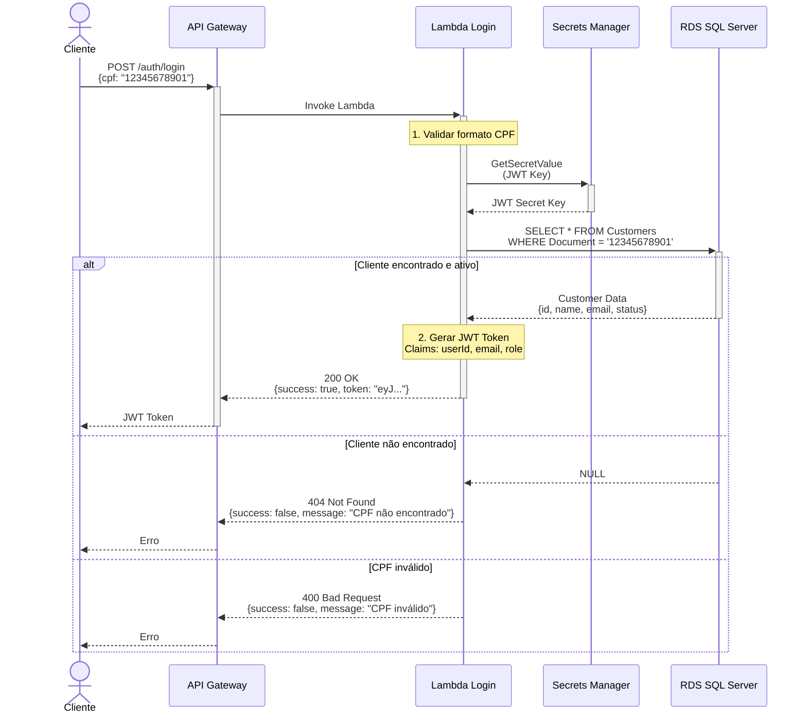
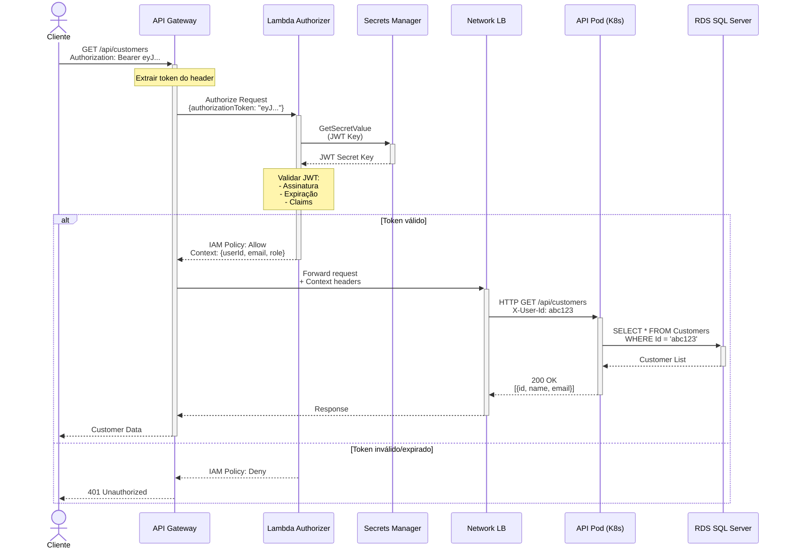
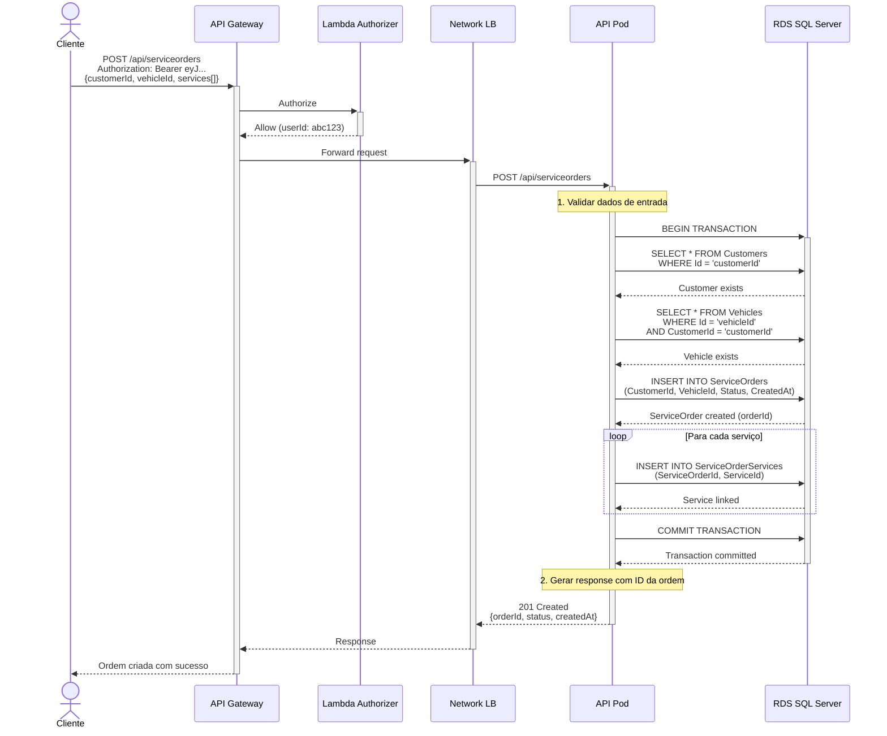
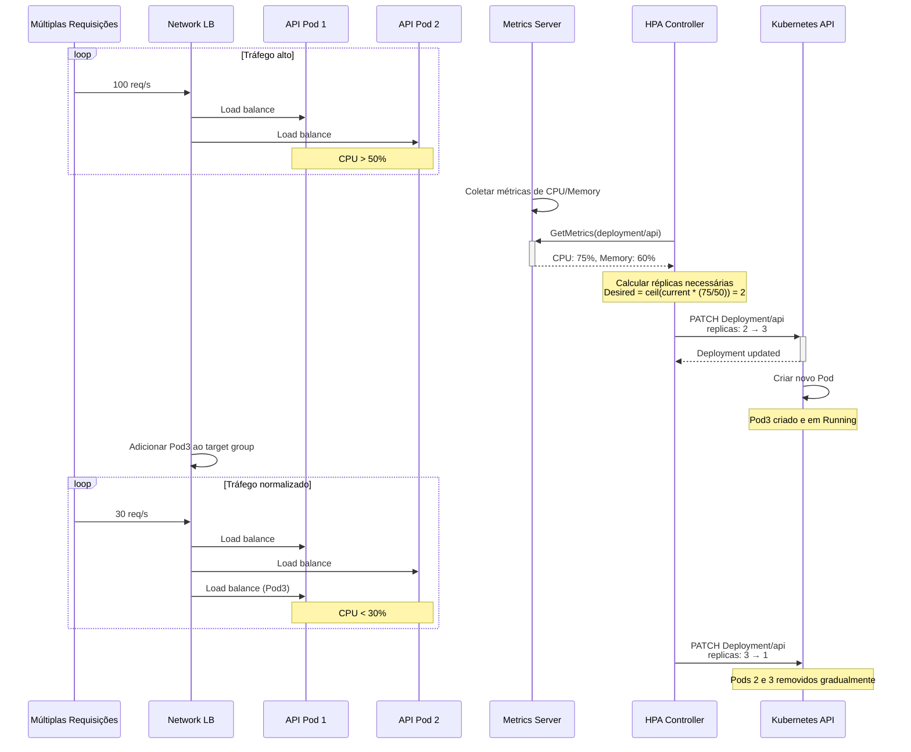
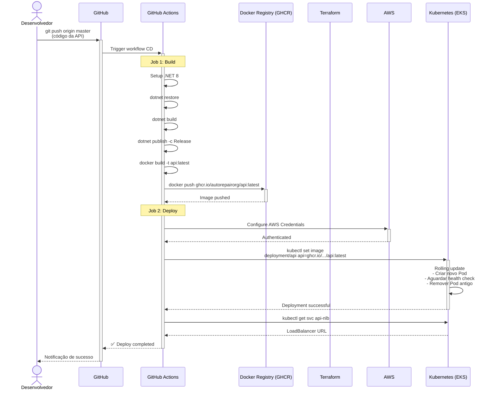
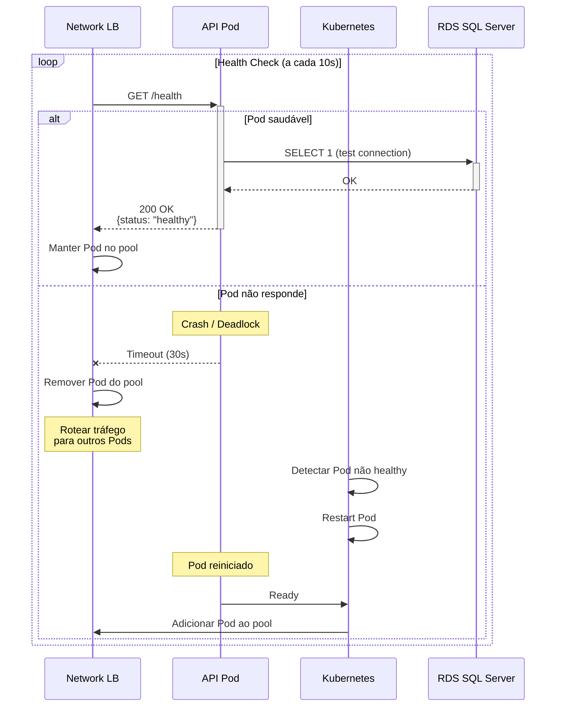
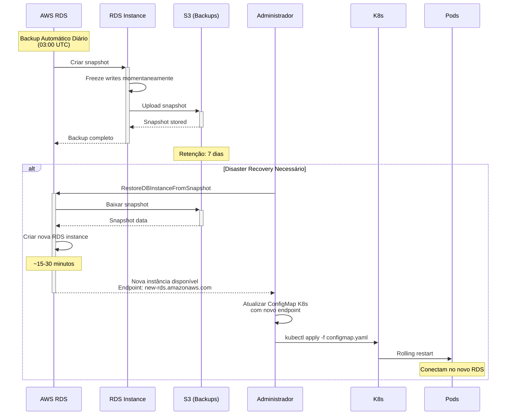
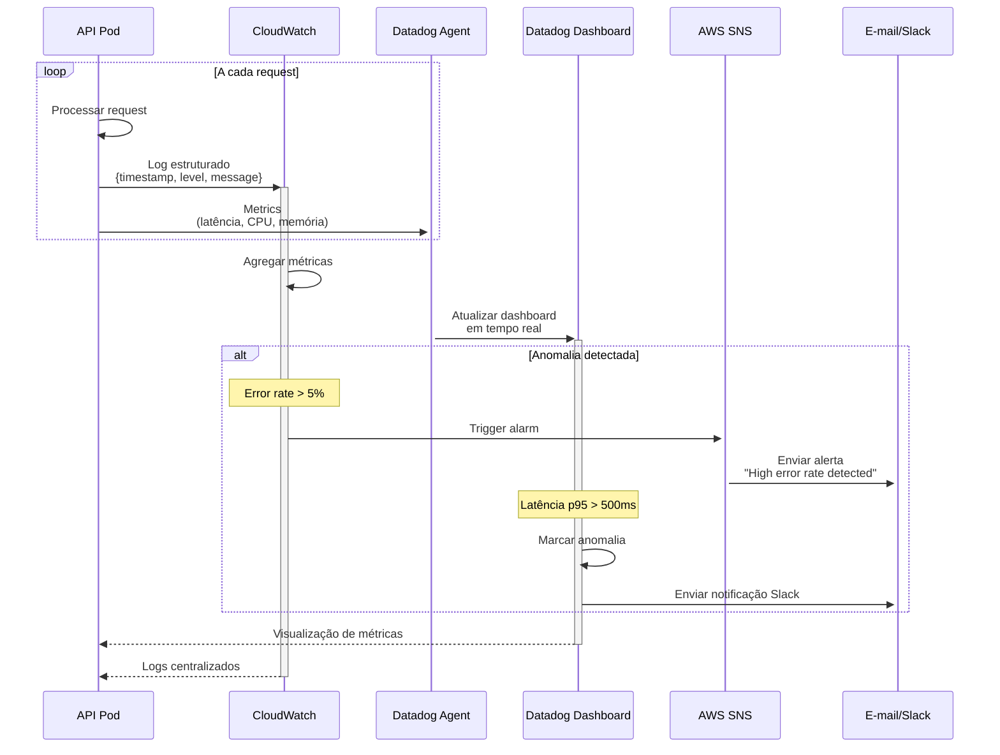

# 🔄 Diagramas de Sequência - AutoRepairShop

## 1. Fluxo de Autenticação (Login)

---

## 2. Fluxo de Requisição Protegida (com JWT)

---

## 3. Fluxo de Criação de Ordem de Serviço

---

## 4. Fluxo de Auto-Scaling (HPA)

---

## 5. Fluxo de Deploy via CI/CD

---

## 6. Fluxo de Recuperação de Falha (Health Check)

---

## 7. Fluxo de Backup e Restore (RDS)

---

## 8. Fluxo de Monitoramento e Alertas

---

## Resumo dos Fluxos

| Fluxo | Atores Principais | Tempo Típico |
|-------|-------------------|--------------|
| Autenticação | Cliente, Lambda, RDS | ~200ms |
| Requisição Protegida | Cliente, Authorizer, API Pod | ~150ms |
| Criar Ordem de Serviço | Cliente, API Pod, RDS | ~300ms |
| Auto-Scaling | HPA, Metrics Server, K8s | ~30-60s |
| Deploy CI/CD | GitHub Actions, K8s | ~5-8min |
| Health Check | NLB, Pod, RDS | ~10s (intervalo) |
| Backup | RDS, S3 | ~15min (diário) |
| Restore | Admin, RDS, K8s | ~30min |
| Monitoramento | CloudWatch, Datadog | Tempo real |

---

## Tratamento de Erros

### **Retry Strategy**
- Lambda: 2 retries automáticos (exponential backoff)
- API Pod → RDS: 3 retries com 1s de intervalo
- NLB Health Check: 3 falhas consecutivas → remove do pool

### **Circuit Breaker**
- API → RDS: Circuito abre após 5 falhas consecutivas
- Timeout: 30s
- Half-open após 60s

### **Fallback**
- Lambda Login: Retorna 503 se RDS indisponível
- API Pod: Cache de leitura para dados estáticos (futuro)

---

**Última atualização:** Agosto 2026  
**Autores:** Dhiulia da Silva, Mateus Pinheiro
